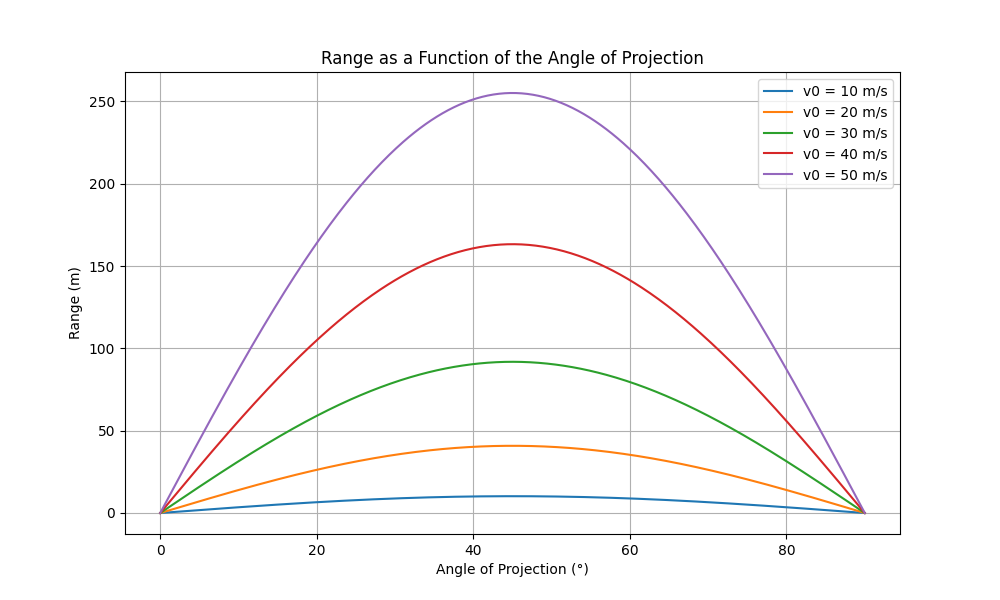

# Problem 1

## Projectile Motion

## Introduction

Projectile motion refers to the motion of an object that is launched into the air and moves under the influence of gravity alone, assuming no air resistance. The motion follows a **parabolic trajectory** due to the constant acceleration caused by gravity.

## Key Components

1. **Initial Velocity (v₀)**: The velocity with which the projectile is launched.
2. **Angle of Projection (θ)**: The angle at which the projectile is launched with respect to the horizontal.
3. **Acceleration Due to Gravity (g)**: The constant acceleration acting downward, typically `9.8 m/s²` on Earth.
4. **Time of Flight (T)**: The total time the projectile remains in the air.
5. **Maximum Height (H)**: The highest vertical position reached by the projectile.
6. **Range (R)**: The horizontal distance covered by the projectile.

## Equations of Motion

Using kinematic equations, we can derive the following formulas for projectile motion:

### 1. Time of Flight (T)

$$
T = \frac{2v_0 \sin \theta}{g}
$$

### 2. Maximum Height (H)

$$
H = \frac{(v_0 \sin(\theta))^2}{2g}
$$

### 3. Range (R)

$$
R = \frac{v_0^2 \sin(2\theta)}{g}
$$

### 4. Equations of Motion

- #### Horizontal Motion:

$$
x = v_0 \cos(\theta) \cdot t
$$

- #### Vertical Motion:

$$
y = v_0 \sin(\theta) \cdot t - \frac{1}{2} g t^2
$$

## Trajectory Equation

The equation representing the parabolic path of the projectile is:

$$
y = x \tan(\theta) - \frac{g x^2}{2 v_0^2 \cos^2(\theta)}
$$

## Conclusion

Projectile motion is an essential concept in physics, applicable in various real-world scenarios like sports, ballistics, and space exploration. Understanding the mathematical principles helps in predicting the motion of objects under gravity.
