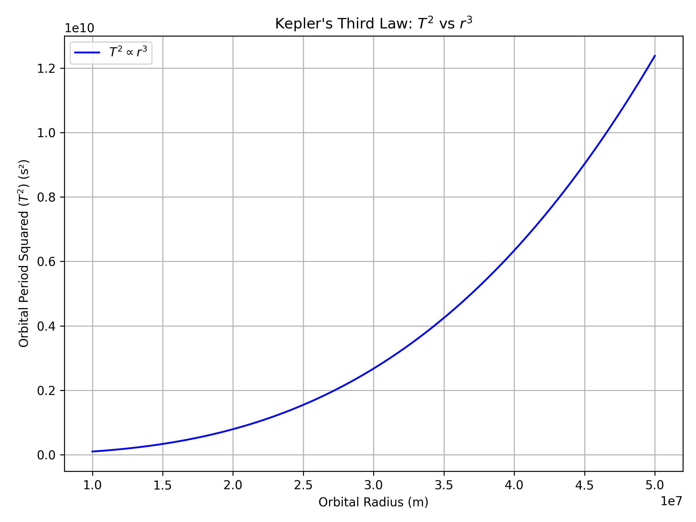
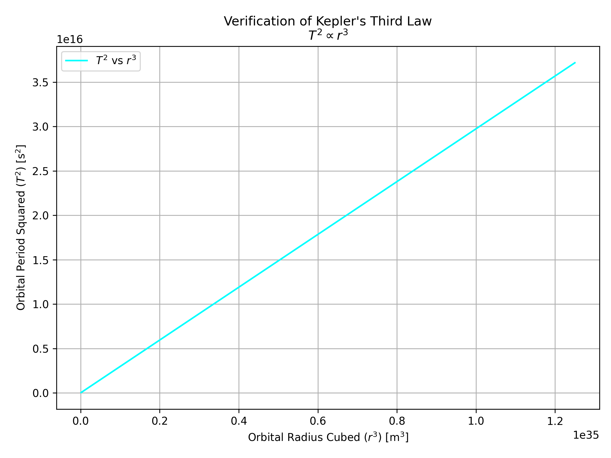

## Orbital Period and Orbital Radius

### Deriving the Relationship Between Orbital Period and Orbital Radius

In celestial mechanics, **Kepler's Third Law** describes the motion of planets in circular orbits around a central body. It states that the **square of the orbital period (T²)** is directly proportional to the **cube of the orbital radius (r³)**.

To derive this relationship, we equate the gravitational force providing the centripetal acceleration:

\[
F*{\text{gravity}} = F*{\text{centripetal}} \Rightarrow \frac{G M m}{r^2} = \frac{m v^2}{r}
\]

Solving for the orbital velocity \( v \), and then substituting into the formula for period \( T = \frac{2\pi r}{v} \), we find:

\[
T^2 = \frac{4\pi^2}{G M} r^3
\]

This derivation shows that \( T^2 \propto r^3 \), confirming Kepler's Third Law for circular orbits.

### Implications of the \( T^2 \propto r^3 \) Relationship in Astronomy

Kepler’s Third Law, expressed as \( T^2 \propto r^3 \), has profound implications in astronomy. It enables scientists to:

- **Determine the mass** of a central celestial body by analyzing the motion of its orbiting objects.
- **Calculate distances** between planets and their stars, especially useful in studying exoplanetary systems.
- Support the foundation of **Newton’s law of universal gravitation**.
- Improve our understanding of the **structure and dynamics** of planetary systems and galaxies.

This relationship remains a cornerstone in orbital mechanics and space exploration.

### Real-World Examples of \( T^2 \propto r^3 \)

This relationship is evident in many real-world cases:

- **The Moon's orbit around Earth** follows Kepler’s Third Law, where its orbital period and distance align with the \( T^2 \propto r^3 \) ratio, helping estimate Earth's mass.
- **Planets in the Solar System** obey this law, with outer planets like Jupiter and Saturn having longer periods due to their greater distances from the Sun.
- **Artificial satellites** also follow this principle, allowing precise placement in orbits for communication and GPS.

These examples show how the law governs both natural and human-made orbital systems.
