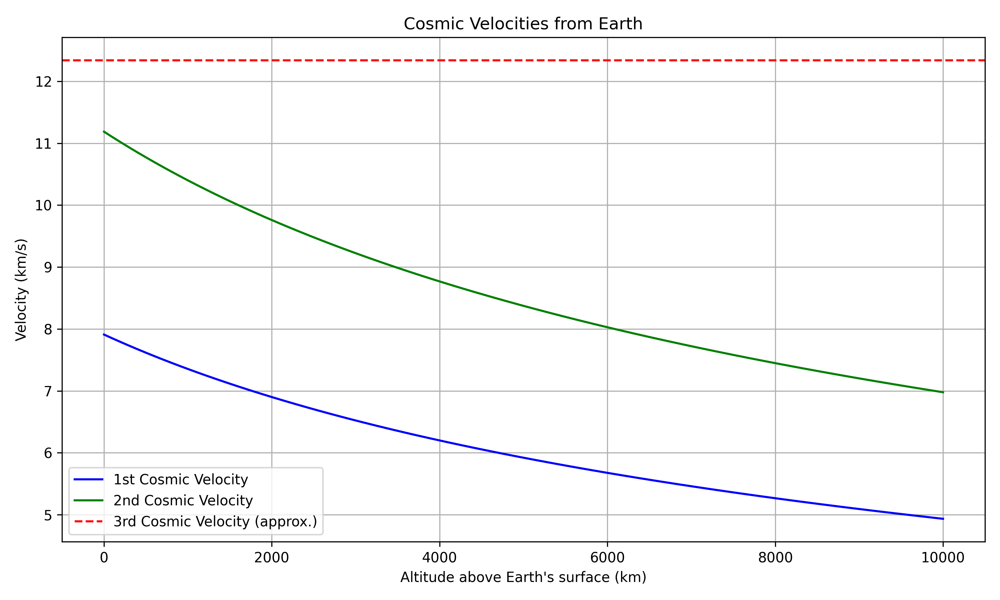
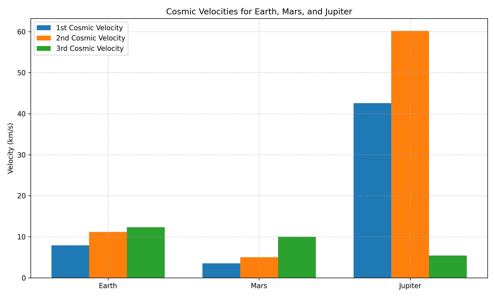

## Escape Velocities and Cosmic Velocities

### The Three Cosmic Velocities

In orbital mechanics, the **cosmic velocities** define the speeds required for different types of motion in a gravitational field, typically around a planet like Earth.

---

#### 1. First Cosmic Velocity (Orbital Velocity)

- **Definition**: The minimum velocity needed to stay in a stable circular orbit around a planet without falling back to its surface.
- **Formula**: \( v_1 = \sqrt{\frac{GM}{r}} \)
- **Meaning**: It allows a satellite to orbit Earth just above the atmosphere. For Earth, it's approximately **7.9 km/s** near the surface.

---

#### 2. Second Cosmic Velocity (Escape Velocity)

- **Definition**: The minimum velocity needed to escape a planet’s gravitational field entirely, without further propulsion.
- **Formula**: \( v_2 = \sqrt{\frac{2GM}{r}} \)
- **Meaning**: A spacecraft must reach this speed to leave Earth and travel into deep space. For Earth, it’s about **11.2 km/s**.

---

#### 3. Third Cosmic Velocity (Interstellar Velocity)

- **Definition**: The minimum velocity needed to escape the gravitational pull of the Sun, starting from Earth's orbit.
- **Approximate Value**: Around **16.7 km/s**, relative to Earth’s motion.
- **Meaning**: Required for a spacecraft to leave the Solar System entirely and travel to other star systems.

---

These velocities are crucial in **space mission planning**, **satellite deployment**, and understanding **gravitational dynamics** in astrophysics.

### Cosmic Velocities for Different Celestial Bodies

Cosmic velocities vary based on the mass and radius of the celestial body. Here's a comparison of the **first**, **second**, and **third cosmic velocities** for **Earth**, **Mars**, and **Jupiter**:

---

#### 1. **First Cosmic Velocity** (\(v_1\))

- Minimum speed to enter a stable circular orbit near the surface.
- Formula: \( v_1 = \sqrt{\frac{GM}{R}} \)

#### 2. **Second Cosmic Velocity** (\(v_2\))

- Minimum speed to escape the body's gravitational field.
- Formula: \( v_2 = \sqrt{2} \cdot v_1 \)

#### 3. **Third Cosmic Velocity** (\(v_3\))

- Minimum speed to escape the **Sun’s gravity** from the planet’s orbit.
- Formula: \( v*3 = \sqrt{2GM*{\odot}/r} - v\_{orbital} \)

---

### Physical Meaning

- **Higher mass and smaller radius** → higher required velocities.
- **Jupiter** has the strongest gravity among the three, requiring the highest speeds.
- **Mars**, being smaller, has much lower escape speeds, making launches easier.

---

### Visualization

A bar chart can be used to compare the three velocities for Earth, Mars, and Jupiter, clearly showing how gravitational strength affects escape and orbital dynamics.

This comparison helps understand mission planning, fuel requirements, and orbital mechanics across different planetary environments.

