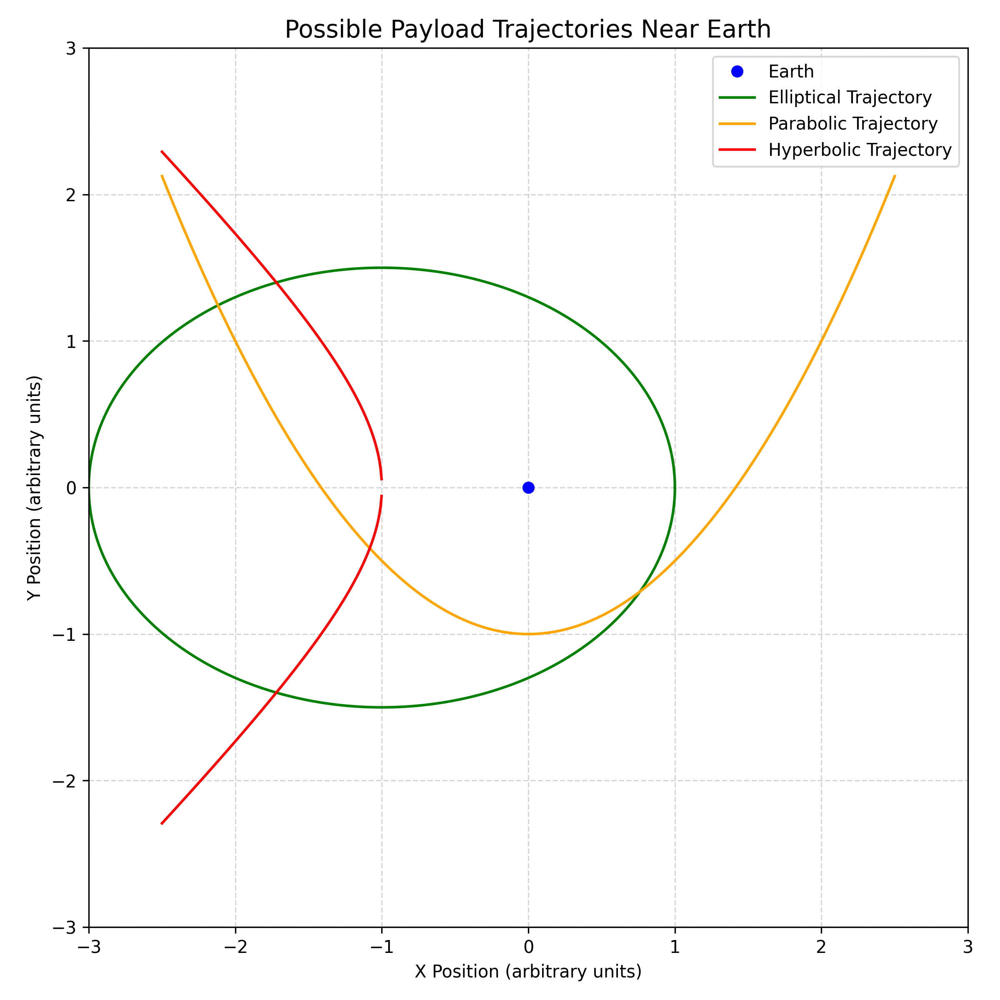

### Trajectories of a Payload Released Near Earth

The trajectory of a payload released near Earth depends on its **initial velocity** relative to Earth's gravitational field. The path it follows can be classified into the following types:

---

#### 1. **Elliptical Trajectory** (Sub-Escape Velocity)

- **Condition**: Initial speed is **greater than 0** but **less than escape velocity**.
- **Shape**: Ellipse
- **Meaning**: The payload remains **gravitationally bound to Earth** and follows a closed orbit. If the speed is just right, it forms a circular orbit; otherwise, it's elliptical.

---

#### 2. **Parabolic Trajectory** (At Escape Velocity)

- **Condition**: Initial speed is **exactly equal to escape velocity**.
- **Shape**: Parabola
- **Meaning**: The payload just escapes Earth’s gravity, moving infinitely far away with **zero residual velocity**.

---

#### 3. **Hyperbolic Trajectory** (Above Escape Velocity)

- **Condition**: Initial speed is **greater than escape velocity**.
- **Shape**: Hyperbola
- **Meaning**: The payload escapes Earth’s gravity and continues moving indefinitely with **excess velocity**, often toward interplanetary or interstellar space.

---

### Summary Table

| Trajectory Type | Initial Speed          | Bound to Earth?   | Path Shape |
| --------------- | ---------------------- | ----------------- | ---------- |
| Elliptical      | \( 0 < v < v\_{esc} \) | Yes               | Ellipse    |
| Parabolic       | \( v = v\_{esc} \)     | No (just escapes) | Parabola   |
| Hyperbolic      | \( v > v\_{esc} \)     | No                | Hyperbola  |

---

These trajectory types are fundamental in **space mission design**, satellite deployment, and understanding **celestial mechanics**.

### Numerical Analysis of Payload Trajectories

To analyze the path of a payload released near Earth, we can perform a **numerical integration** based on the laws of **Newtonian gravity**. The objective is to compute the payload’s trajectory over time, given its initial **position**, **velocity**, and **altitude**.

#### Key Concepts:

1. **Gravitational Force**: The gravitational force exerted by Earth on the payload is given by:

   $$
   F = \frac{GMm}{r^2}
   $$

   where:

   - \( G \) is the gravitational constant,
   - \( M \) is the mass of Earth,
   - \( m \) is the mass of the payload,
   - \( r \) is the distance from the center of the Earth to the payload.

2. **Equations of Motion**: The trajectory can be computed by solving the second-order differential equations for position:

   $$
   \mathbf{F} = m \mathbf{a} = m \frac{d^2 \mathbf{r}}{dt^2}
   $$

   where \( \mathbf{r} \) is the position vector and \( \mathbf{a} \) is the acceleration of the payload.

3. **Initial Conditions**: The initial conditions (position and velocity) are provided at the start, such as:

   - **Initial position**: \( (x_0, y_0) \) in meters.
   - **Initial velocity**: \( (v*{x0}, v*{y0}) \) in meters per second.
   - **Altitude**: The starting altitude above Earth’s surface.

4. **Numerical Integration**: A simple **Euler method** or **Runge-Kutta method** can be used to numerically integrate the equations of motion and track the payload’s trajectory over time.

#### Steps to Perform the Numerical Analysis:

1. **Set Initial Conditions**: Define the payload's initial position, velocity, and altitude.
2. **Compute Gravitational Force**: For each time step, compute the gravitational force acting on the payload.
3. **Update Position and Velocity**: Using numerical methods (Euler or higher-order methods), update the position and velocity of the payload for each time step based on the computed force.
4. **Repeat**: Continue the process for each time step to compute the path.

5. **Visualize the Trajectory**: After performing the integration, plot the trajectory of the payload in a 2D or 3D space.

---

### Applications:

- **Space Mission Planning**: This analysis helps in determining the trajectory of spacecraft, including satellite launches, orbital paths, and escape trajectories.
- **Predicting Re-Entry Paths**: By considering initial velocities and altitudes, we can predict the re-entry path of a spacecraft or payload.
- **Trajectory Optimization**: Numerical analysis can be used to optimize the launch parameters for the most efficient path, minimizing fuel usage or maximizing the payload delivery.

---

### Conclusion:

By performing a **numerical analysis** of the payload's motion using initial conditions, we can simulate various types of trajectories, including elliptical, parabolic, or hyperbolic paths. This analysis is fundamental for **space exploration**, **satellite deployment**, and **spacecraft mission planning**.
