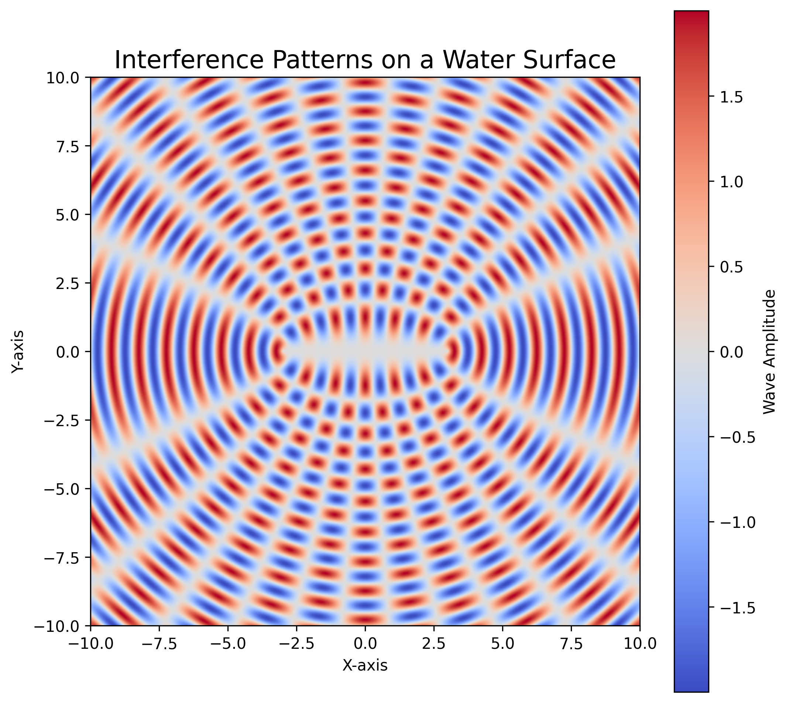
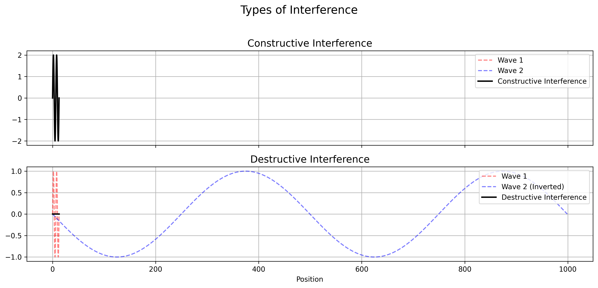
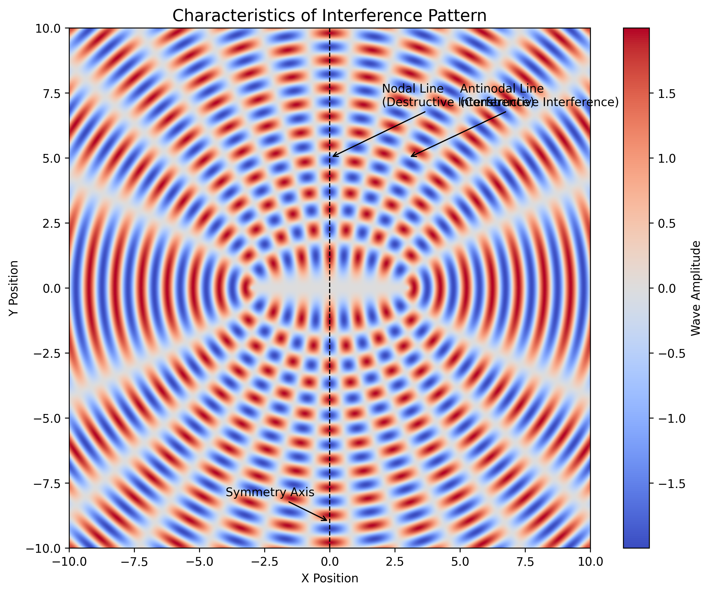
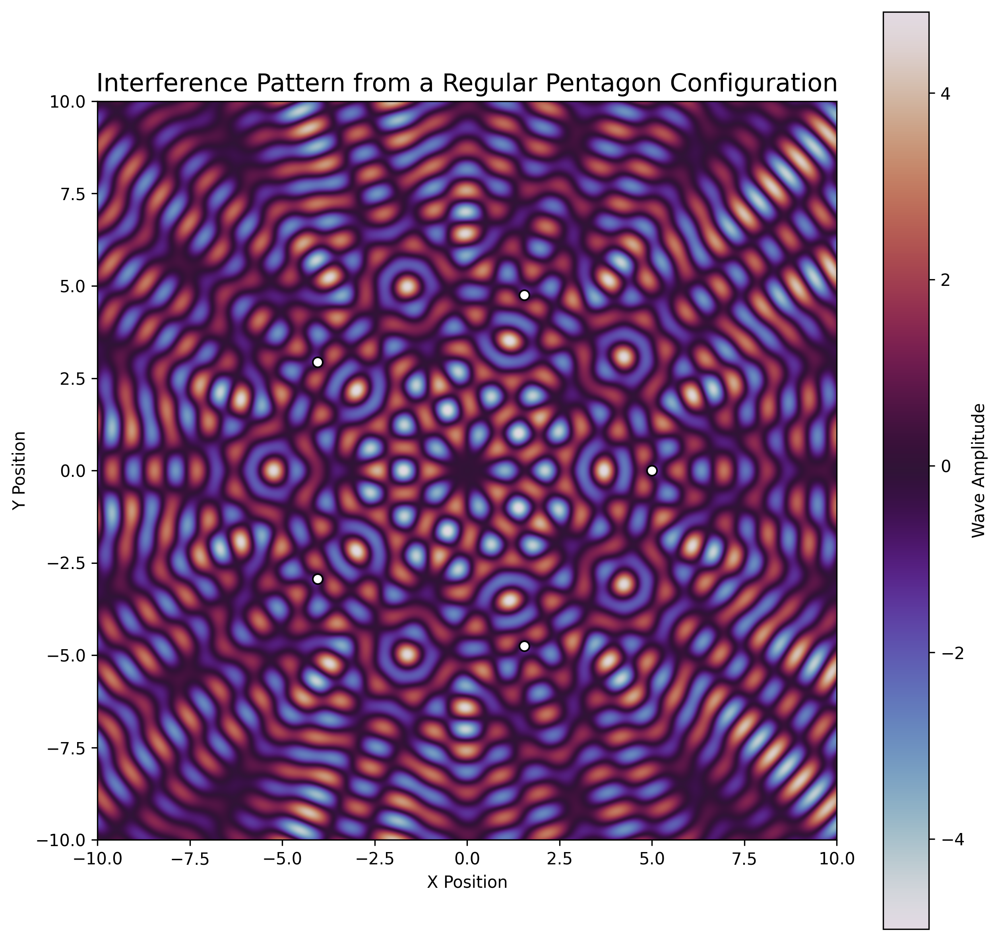

# Interference Patterns on a Water Surface

Interference patterns on a water surface occur when two or more sets of waves interact with each other. These patterns are a direct result of the **principle of superposition**, which states that when two or more waves meet at a point, the resulting wave displacement is the sum of the individual displacements.

## Types of Interference

- **Constructive Interference**: When the crests (or troughs) of two waves coincide, they reinforce each other, creating a wave of greater amplitude.
- **Destructive Interference**: When the crest of one wave coincides with the trough of another, they cancel each other out, reducing the wave amplitude or eliminating it entirely.

## Observing the Pattern

Interference patterns are typically observed in a **ripple tank** or in natural settings where multiple wave sources are present, such as:

- Droplets falling into a calm water surface.
- Two pebbles dropped close together.
- Waves reflecting off obstacles.

The resulting pattern consists of a series of alternating **bright (high-amplitude)** and **dark (low-amplitude or calm)** regions, forming a distinctive pattern of lines or curves.

## Characteristics

- **Nodal Lines**: Areas of destructive interference where little or no motion is visible.
- **Antinodal Lines**: Areas of constructive interference where wave motion is most visible.
- **Symmetry**: The pattern is often symmetric around the line joining the sources.

## Real-World Applications

Understanding interference on water surfaces helps illustrate broader wave phenomena such as:

- Light and sound interference
- Seismic wave behavior
- Radio signal propagation

Interference patterns offer a fascinating glimpse into the wave nature of energy and matter, reinforcing fundamental concepts of physics and wave mechanics.

# 🌊 Wave Interference from a Regular Polygon Configuration

This simulation demonstrates the interference pattern created when **point wave sources** are placed at the **vertices of a regular polygon**. We'll use a **regular pentagon** for this example.

---

## 1. Select a Regular Polygon

We choose a **regular pentagon** with 5 vertices equally spaced around a circle. This polygon is centered at the origin (0, 0), and each vertex lies at a fixed distance (radius) from the center.

---

## 2. Position the Sources

We place point wave sources at the pentagon’s vertices. The positions \((x_i, y_i)\) of the sources are calculated using polar coordinates:

\[
x_i = r \cdot \cos\left(\frac{2\pi i}{n}\right), \quad y_i = r \cdot \sin\left(\frac{2\pi i}{n}\right)
\]

Where:

- \( n = 5 \) (number of vertices)
- \( r = 5 \) (radius from the center)

---

## 3. Define the Wave Equations

Each source emits circular waves described by the equation:

\[
\psi_i(x, y) = \sin(k \cdot r_i)
\]

Where:

- \( \psi_i \) is the wave from source \( i \)
- \( r_i = \sqrt{(x - x_i)^2 + (y - y_i)^2} \)
- \( k = \frac{2\pi}{\lambda} \) is the wave number
- \( \lambda \) is the wavelength

---

## 4. Superposition of Waves

The total wave displacement at a point \((x, y)\) on the surface is the **sum of displacements** from all the sources:

\[
\Psi(x, y) = \sum\_{i=1}^{n} \psi_i(x, y)
\]

This represents the **interference pattern**, showing areas of **constructive** and **destructive** interference.

---

## 🧠 Result & Visualization

The resulting interference pattern exhibits:

- **Symmetry** consistent with the polygon (pentagonal pattern)
- **Nodal lines** where waves cancel (destructive interference)
- **Antinodal lines** where waves amplify (constructive interference)

The pattern is a beautiful demonstration of **wave superposition** in 2D space.

## 

## 📌 Applications

- Wave physics and optics
- Seismic wave modeling
- Acoustics and sound design
- Art and pattern generation
