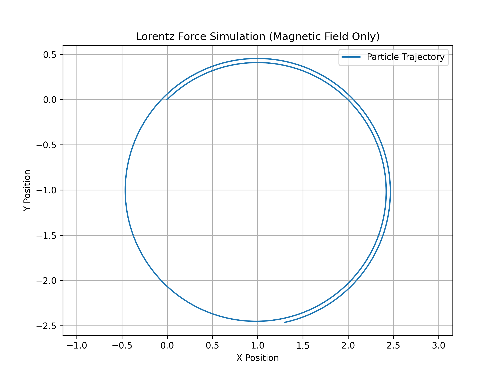
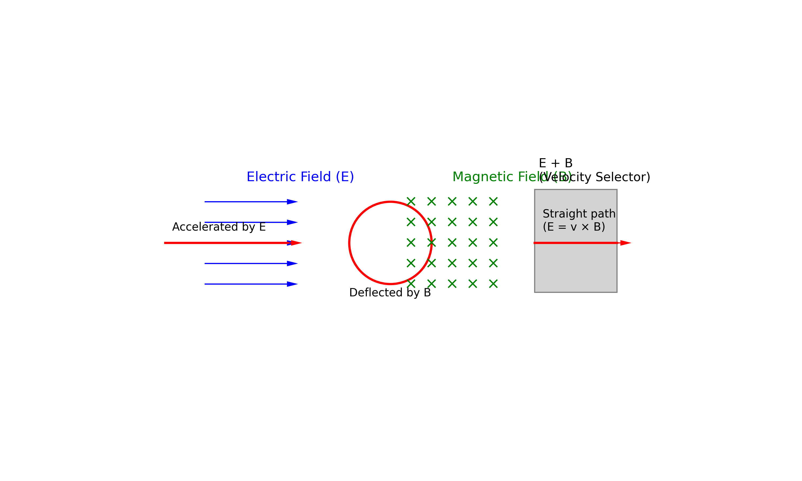
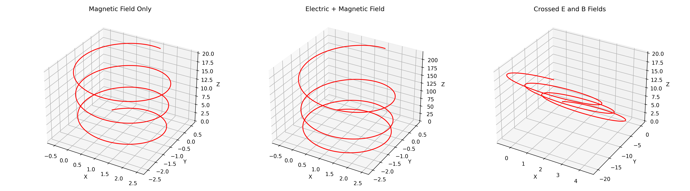
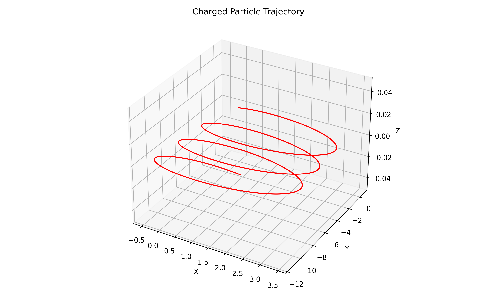

## Simulating the Effects of the Lorentz Force

The Lorentz Force describes the force experienced by a charged particle moving through electric and magnetic fields. Simulating this effect involves numerically solving the equations of motion derived from the Lorentz Force law:

**F = q(E + v × B)**

where:

- _F_ is the force on the particle,
- _q_ is the charge,
- _E_ is the electric field,
- _v_ is the velocity of the particle, and
- _B_ is the magnetic field.

These simulations help visualize particle trajectories in fields, understand electromagnetic behavior, and model real-world systems like particle accelerators and plasma confinement devices.

## 

## Systems Where the Lorentz Force Plays a Key Role

The Lorentz force is fundamental in many physical systems and technologies that involve charged particle motion under electric and magnetic fields. Below are several key examples:

### 1. **Particle Accelerators**

In devices like cyclotrons and synchrotrons, the Lorentz force guides and accelerates charged particles along circular or spiral paths. Magnetic fields bend the particles' trajectories, while electric fields are used to increase their speed.

### 2. **Mass Spectrometers**

These instruments use electric and magnetic fields to separate ions based on their mass-to-charge ratio. The Lorentz force causes ions to curve as they travel through the magnetic field, allowing for precise mass analysis.

### 3. **Plasma Confinement in Fusion Reactors**

In magnetic confinement fusion devices (e.g., tokamaks), strong magnetic fields exert Lorentz forces that confine hot plasma, preventing it from touching reactor walls and enabling sustained fusion reactions.

### 4. **Cathode Ray Tubes (CRTs)**

In older televisions and oscilloscopes, the Lorentz force deflects electron beams to create images on a fluorescent screen. Electric and magnetic fields steer the beam precisely.

### 5. **Auroras and Earth's Magnetosphere**

Charged particles from the solar wind interact with Earth's magnetic field, and the Lorentz force directs them toward the poles. This interaction causes auroras and affects satellite and communication systems.

These applications highlight how the Lorentz force underpins both advanced scientific instruments and natural phenomena.

## Role of Electric (E) and Magnetic (B) Fields in Controlling Charged Particle Motion

Electric and magnetic fields are essential tools for manipulating the motion of charged particles, based on the Lorentz force law:

**F = q(E + v × B)**

where:

- _F_ is the force on the particle,
- _q_ is the charge,
- _E_ is the electric field,
- _v_ is the particle's velocity,
- _B_ is the magnetic field.

### ⚡ Electric Fields (E)

- Electric fields exert a **direct linear force** on charged particles.
- The force direction is along the field for positive charges and opposite for negative charges.
- Electric fields are used to **accelerate or decelerate** particles.
- Common in devices like **electron guns**, **capacitors**, and **linear accelerators**.

### 🧲 Magnetic Fields (B)

- Magnetic fields exert a force **perpendicular to both the velocity and the field direction**.
- This causes the particle to move in **curved or helical paths**.
- Magnetic fields are ideal for **steering or confining** particle motion without changing their speed.
- Found in **cyclotrons**, **mass spectrometers**, and **magnetic confinement fusion** systems.

### 🔁 Combined E and B Fields

- When both fields are present, their combined influence can finely control particle trajectories.
- Example: In **velocity selectors**, only particles with a specific speed pass through undeflected, using orthogonal E and B fields.

Understanding and harnessing the interaction between these fields and charged particles is foundational in fields ranging from electronics and medical imaging to astrophysics and nuclear fusion.

## 

## Charged Particle Trajectory Simulation under Electromagnetic Fields

This simulation models and visualizes the motion of a charged particle under different configurations of electric (**E**) and magnetic (**B**) fields using the Lorentz force law:

**F = q(E + v × B)**

### Simulated Configurations:

1. **Magnetic Field Only**
   - Particle moves in a **circular** or **helical** path due to the perpendicular magnetic force.
2. **Combined Electric and Magnetic Fields**

   - Results in **helical motion** along the direction of the electric field, with a superimposed circular path due to the magnetic field.

3. **Crossed Electric and Magnetic Fields**
   - The particle experiences a **drift motion**, moving perpendicular to both fields (E × B direction).

### Features:

- Numerical integration of motion using time-stepping.
- 3D visualization of particle trajectories for each field setup.
- Automatically saves and downloads a diagram (`lorentz_trajectories.png`) of all three simulations.

This tool is ideal for educational purposes and helps in understanding charged particle dynamics in electromagnetic fields.

## 

## Parameter Exploration

This section allows users to explore how different physical parameters influence the motion of a charged particle under electromagnetic fields. By varying these inputs, one can observe significant changes in the particle's trajectory:

### Parameters to Vary:

- **Electric Field Strength (E)**
- **Magnetic Field Strength (B)**
- **Initial Velocity (v)**
- **Charge (q)** and **Mass (m)** of the Particle

### Observations:

- Stronger **magnetic fields** lead to tighter circular orbits (smaller radius).
- Higher **electric fields** can increase acceleration and drift.
- Changing the **initial velocity** affects the shape and orientation of the trajectory (linear, circular, helical).
- Varying **charge and mass** alters the force magnitude and resulting motion pattern.

This exploration demonstrates the dynamic nature of charged particle motion and highlights the sensitivity of trajectories to physical conditions.

## 
