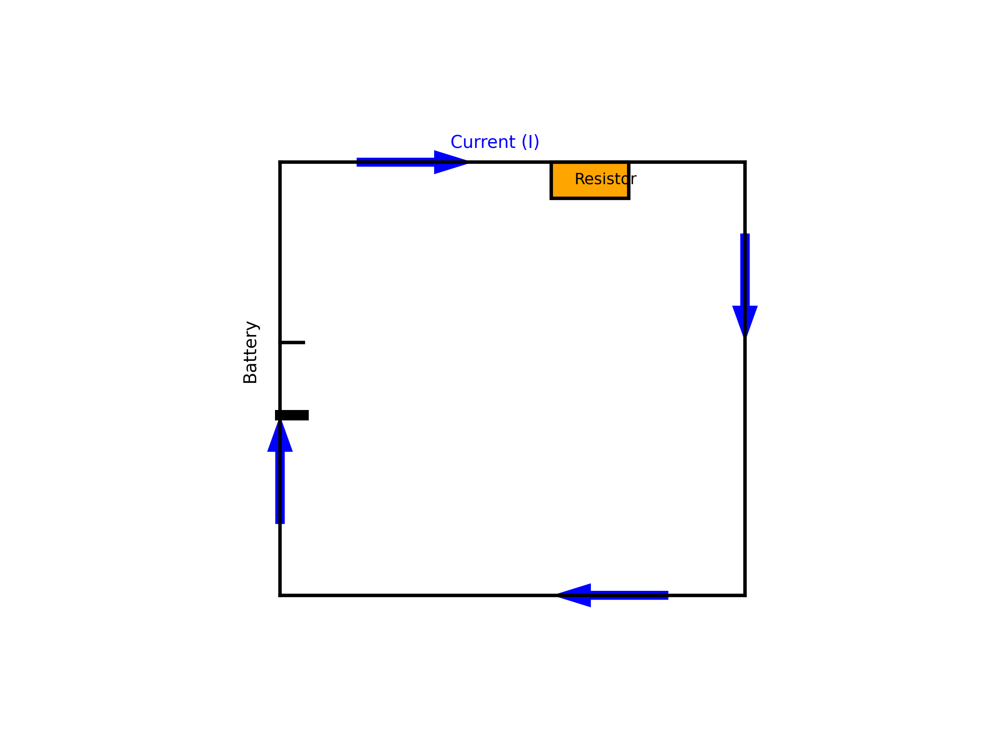
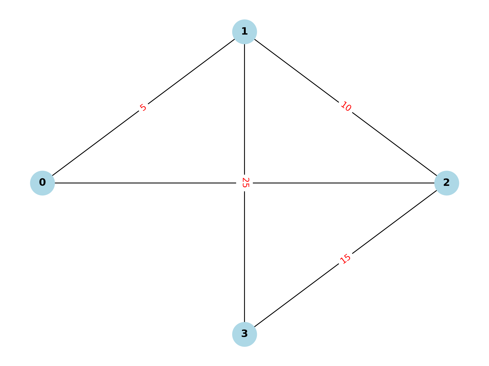
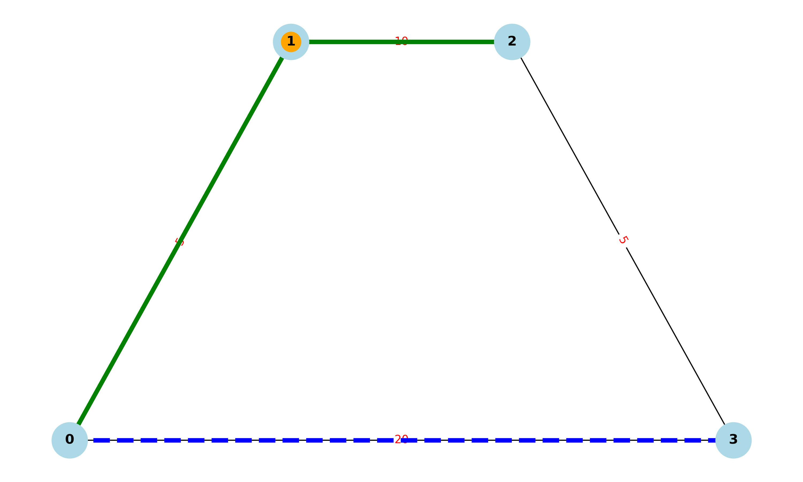

## What is an Electric Circuit?

An **electric circuit** is a closed loop or pathway that allows **electric current** to flow. It typically includes:

- A **power source** (e.g., battery or generator)
- **Conductive wires** to carry the current
- One or more **electrical components** (e.g., resistors, bulbs, switches)

For a circuit to work, it must be **complete and unbroken** so that charges can move continuously. Circuits are fundamental in powering electrical devices and systems.

## 

## Calculating Equivalent Resistance Using Graph Theory

In graph theory, an electric circuit can be represented as a graph where:

- **Nodes (vertices)** represent circuit junctions.
- **Edges** represent resistors, each with a weight equal to its resistance.

To compute the **equivalent resistance** between two nodes, graph-based methods such as the following are used:

### Algorithm Steps:

1. **Model the circuit** as an undirected weighted graph (resistors are bidirectional).
2. **Create the conductance matrix** (inverse of resistance for each edge).
3. **Build the Laplacian matrix (L)** of the graph, where:
   - `L = D - A`
   - `D`: Degree matrix (sum of conductances connected to each node)
   - `A`: Adjacency matrix of conductances
4. **Use the Moore-Penrose pseudoinverse** of the Laplacian (`L⁺`) to find the equivalent resistance:
   - `R_eq(a, b) = L⁺[a,a] + L⁺[b,b] - 2 * L⁺[a,b]`

This method is powerful for analyzing **complex resistor networks**, especially in software and computational circuits.

## 

Function CalculateEquivalentResistance(graph, node_start, node_end):
While number of edges > 1:
For each node N in graph:

            # --- Series Reduction ---
            If N has exactly two neighbors (A and B) and N is not start or end:
                R1 = resistance between N and A
                R2 = resistance between N and B
                Replace edges (A-N) and (N-B) with a single edge (A-B) of resistance R1 + R2
                Remove node N

            # --- Parallel Reduction ---
            For each pair of nodes (U, V) with multiple edges:
                Combine all resistors R1, R2, ..., Rn between U and V
                R_parallel = 1 / (1/R1 + 1/R2 + ... + 1/Rn)
                Replace multiple edges with a single edge (U-V) of resistance R_parallel

    Return resistance between node_start and node_end

    ## Pseudocode Explanation: Series and Parallel Resistor Reduction

This pseudocode outlines an algorithm to compute the **equivalent resistance** between two nodes in a resistor network by identifying and reducing **series** and **parallel** connections.

## 

### Key Concepts:

- **Graph Representation**:  
  The resistor network is modeled as an **undirected weighted graph**, where:

  - **Nodes** represent circuit junctions.
  - **Edges** represent resistors, with weights equal to resistance values.

- **Series Reduction**:  
  A node connected to **exactly two other nodes** (and not being a start or end terminal) is a **series node**.

  - The resistors connected in series can be combined by summing their resistances:
    $$
     \[
     R\_{\text{eq}} = R_1 + R_2
     \]
    $$

- **Parallel Reduction**:  
  If **multiple resistors exist between the same pair of nodes**, they are in **parallel**.
  - These can be combined using the reciprocal rule:
    $$
      \[
      \frac{1}{R\_{\text{eq}}} = \frac{1}{R_1} + \frac{1}{R_2} + \dots + \frac{1}{R_n}
      \]
    $$

### Algorithm Steps:

1. **Loop** through the graph until only one edge remains between the source and target nodes.
2. Identify **series nodes** and reduce them by combining connected resistors.
3. Identify **parallel edges** between node pairs and replace them with a single equivalent resistor.
4. **Repeat** the reduction until a single equivalent resistance is found between the start and end nodes.

This approach simplifies complex resistor networks and is especially useful in automated circuit analysis and educational simulations.
