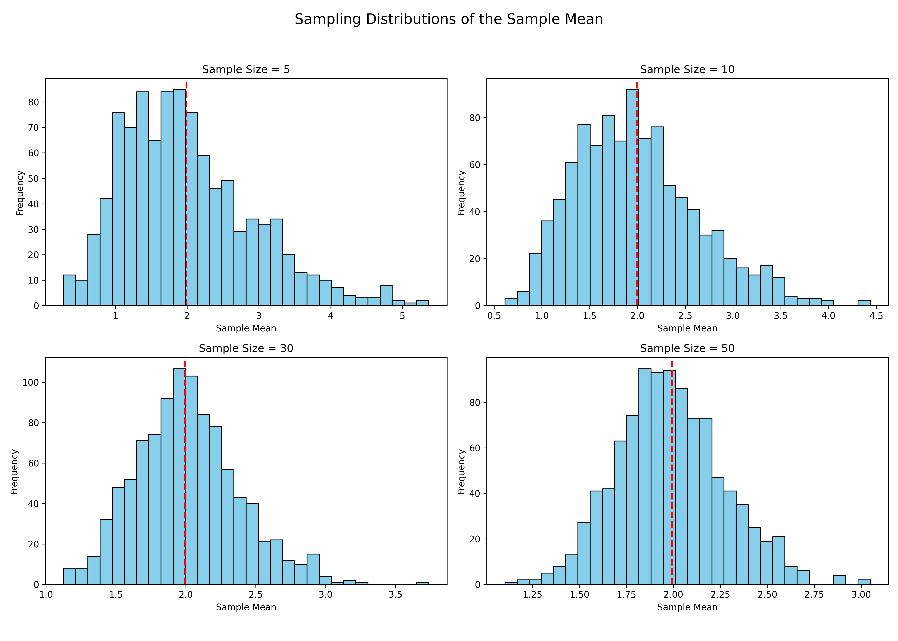
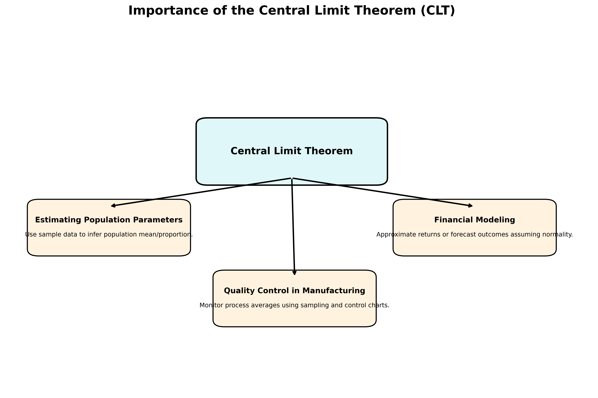

## Types of Population Distributions

Population distribution describes how individuals in a population are spaced within a given area. There are several common types of population distributions:

### 1. **Uniform Distribution**

- Individuals are **evenly spaced** throughout an area.
- Often occurs in species that **compete for resources** or maintain **territorial boundaries**.
- Example: Nesting penguins keeping equal distance from each other.

### 2. **Random Distribution**

- The position of each individual is **independent of others**.
- Rare in nature; usually occurs in environments with **abundant and consistent resources**.
- Example: Dandelions scattered by wind in a field.

### 3. **Clumped Distribution**

- Individuals are grouped into **patches or clusters**.
- This is the **most common** type in nature.
- Caused by factors like **resource availability**, **social behavior**, or **reproduction strategies**.
- Example: Herds of elephants, schools of fish, or flocks of birds.

### 4. **Gradient or Zonal Distribution** _(Ecological Context)_

- Population density changes **along a gradient**, such as elevation, temperature, or moisture.
- Common in ecological niches like mountain ranges or aquatic depth zones.
- Example: Plant species changing with altitude.

### Summary Table

| Distribution Type | Appearance       | Common Causes                           |
| ----------------- | ---------------- | --------------------------------------- |
| Uniform           | Even spacing     | Competition, territorial behavior       |
| Random            | No pattern       | Abundant resources, lack of interaction |
| Clumped           | Clustered groups | Resource patches, social grouping       |
| Gradient/Zonal    | Density changes  | Environmental gradients                 |

## .png>)

## Sampling Distribution of the Sample Mean

The figure illustrates the **sampling distributions** of the **sample mean** derived from a **skewed population** (exponential distribution), for various sample sizes:

- Sample sizes used: **5, 10, 30, and 50**
- For each size, **1000 random samples** were drawn, and their **means** were calculated
- Histograms of these sample means are shown in each subplot

### Key Observations:

- **Small sample sizes** (e.g., 5) yield a distribution of sample means that is still **skewed**, resembling the original population.
- As the **sample size increases**, the distribution of sample means becomes:
  - **More symmetric**
  - **Closer to a normal distribution**
- This trend demonstrates the **Central Limit Theorem (CLT)**, which states that the distribution of the sample mean approaches normality as the sample size increases, regardless of the shape of the original population.

The red dashed line in each histogram marks the **true population mean** as a reference point.

## 

## Importance of the Central Limit Theorem (CLT) in Real-World Applications

The **Central Limit Theorem (CLT)** is a foundational concept in statistics with wide-ranging implications across various fields. It states that, regardless of the population's distribution, the distribution of the sample mean approaches a **normal distribution** as the sample size becomes large.

### Real-World Applications:

- **Estimating Population Parameters**:

  - CLT enables the use of sample data to make **inferences about population means and proportions** with known confidence levels.
  - It forms the basis for **confidence intervals** and **hypothesis testing**.

- **Quality Control in Manufacturing**:

  - In processes where products are sampled (e.g., checking lengths, weights, tolerances), CLT allows for **monitoring average quality metrics** using control charts.
  - Detects whether a process is **statistically under control**.

- **Predicting Outcomes in Financial Models**:

  - Financial analysts use CLT to assume that **returns of asset portfolios** follow a normal distribution (when sample size is large), allowing for **risk estimation** (e.g., VaR).
  - Simplifies modeling in **option pricing** and **Monte Carlo simulations**.

  ## 

### Summary:

The CLT provides a powerful tool to apply **normal probability models** even when the underlying data is not normally distributed, enabling **robust decision-making** based on sampling.
