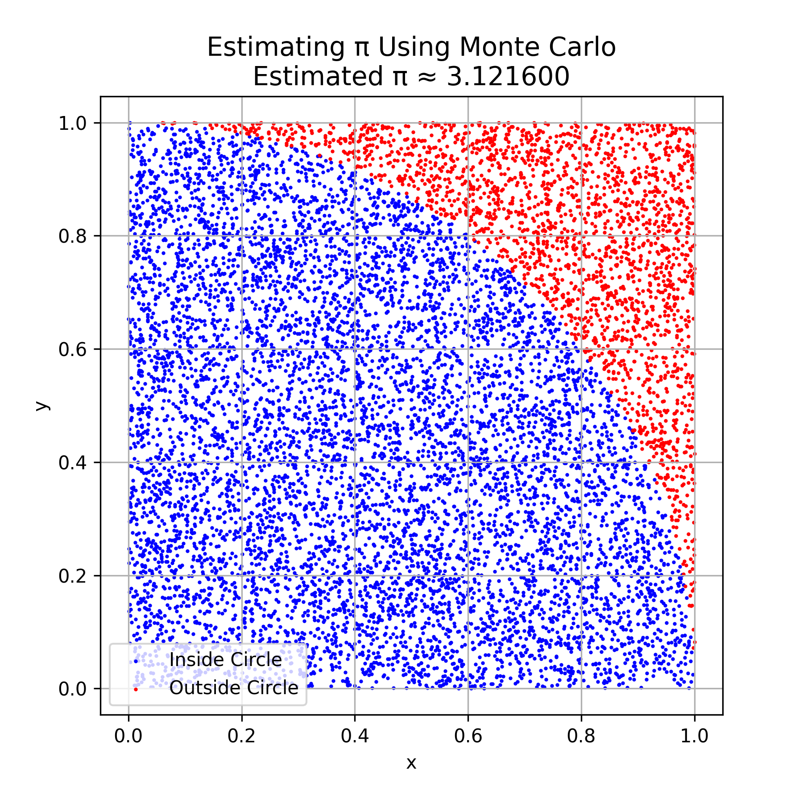
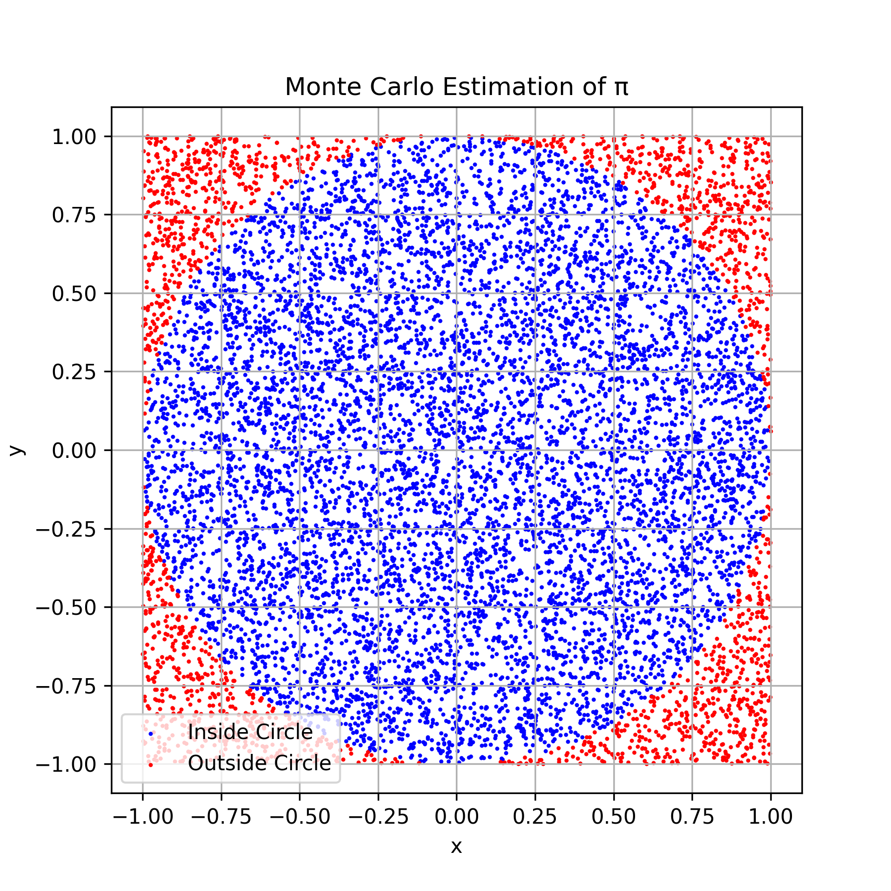
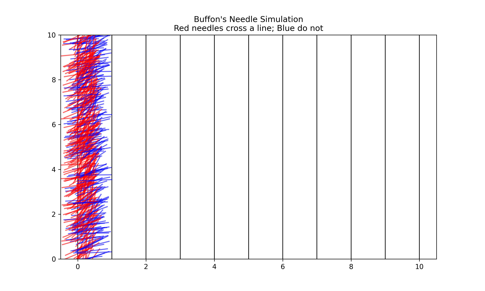

## Estimating π Using Monte Carlo Methods

Monte Carlo methods use **random sampling** to estimate numerical values. One classic application is estimating the value of **π (pi)** by simulating points in a square and checking how many fall inside a quarter circle.

### Method Overview:

- A square of side length 1 is considered, enclosing a quarter circle of radius 1.
- Random points are generated within the square.
- The ratio of points that fall **inside the quarter circle** to the total number of points approximates the **area ratio** between the circle and the square.
- Since the area of a quarter circle is (π/4), multiplying this ratio by 4 gives an estimate for π.

### Formula:

\[
\pi \approx 4 \times \frac{\text{Number of points inside the circle}}{\text{Total number of points}}
\]

This simple yet powerful method demonstrates how randomness and probability can be used to estimate mathematical constants with increasing accuracy as the number of samples grows.

## 

# Estimating π Using Random Points in a Square

## Concept

You can estimate the value of π using a **Monte Carlo method** by comparing the number of points that fall inside a circle to the total number of points within a square that encloses the circle.

## How It Works

- Draw a **unit circle** (radius = 1) centered at the origin.
- Enclose it in a square that spans from -1 to 1 on both the x and y axes.
- The side length of the square is 2, so the **area of the square** is:

- The **area of the unit circle** is:

- Randomly generate many points within the square.
- Count how many points fall **inside the circle** using the condition:

- Let:
- `total_points` = total number of random points
- `points_inside_circle` = number of points satisfying \( x^2 + y^2 ≤ 1 \)

Then, the ratio of points inside the circle to the total number of points approximates the ratio of the areas:

## Final Formula

Multiplying both sides of the equation by 4 gives the approximation:

This formula provides an estimate for π using a probabilistic approach. The larger the number of random points, the more accurate the estimation will be.

## 

## Buffon's Needle Problem

Buffon's Needle is a probability method to estimate the value of π by dropping a needle onto a plane with equally spaced parallel lines.

If a needle of length `L` is dropped randomly on a plane with parallel lines spaced `d` units apart (where `L ≤ d`), the probability that the needle crosses a line depends on π.

By repeating this experiment many times, we can estimate π using the observed number of crossings.

### Formula

\[
\pi \approx \frac{2 \cdot \text{needle length} \cdot \text{number of throws}}{\text{distance between lines} \cdot \text{number of crossings}}
\]

This method demonstrates how geometry and probability can be used to approximate π.

## 

## Exploring the Effect of Needle Drops on Estimate Accuracy

This experiment investigates how the number of needle drops in Buffon's Needle simulation influences the accuracy of the π estimate. By increasing the number of trials, the estimate is expected to converge more closely to the true value of π.

Additionally, the convergence rate of Buffon's Needle method is compared to the classical circle-based Monte Carlo method for estimating π. Understanding the relative efficiency and speed of convergence of these two probabilistic methods provides insight into their practical applications and limitations.

### 🔁 Comparison: Buffon’s Needle vs. Circle-based Method

| Aspect                 | Buffon’s Needle                                        | Circle-based Monte Carlo                          |
| ---------------------- | ------------------------------------------------------ | ------------------------------------------------- |
| **Principle**          | Uses geometric probability with random needle drops    | Uses random points inside a square and a circle   |
| **Visualization**      | Simulated needles crossing parallel lines              | Points inside or outside a quarter-circle         |
| **Accuracy**           | Slower convergence, higher variance                    | Faster convergence, more stable estimates         |
| **Computational Cost** | Requires trigonometry and angle calculations           | Simple distance calculation (Pythagorean theorem) |
| **Educational Value**  | Classic and elegant example of probability in geometry | Easy to implement and visualize in simulations    |

---

### 📝 Summary

- **Buffon’s Needle** is a classical probabilistic method that illustrates geometric probability but converges slowly.
- **Circle-based Monte Carlo** is simpler and more computationally efficient, making it better suited for accurate π estimation in practice.
